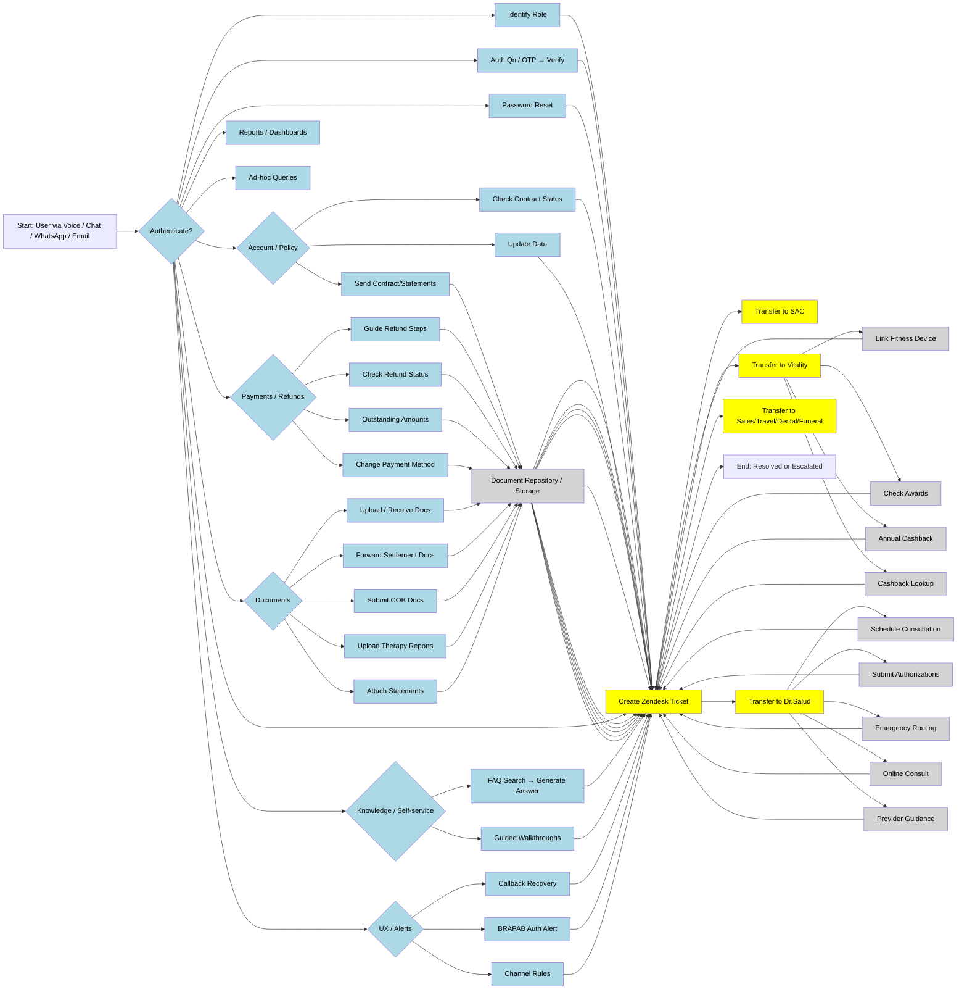

```mermaid
flowchart LR

%% User Entry
A[Start: User via Voice / Chat / WhatsApp / Email]
B{Authenticate?}
B1[Identify Role]
B2[Auth Qn / OTP → Verify]
B3[Password Reset]

%% Account / Policy
C{Account / Policy}
C1[Check Contract Status]
C2[Send Contract/Statements]
C3[Update Data]

%% Payments
D{Payments / Refunds}
D1[Guide Refund Steps]
D2[Check Refund Status]
D3[Outstanding Amounts]
D4[Change Payment Method]

%% Ticketing & Transfers
E1[Create Zendesk Ticket]
E2[Transfer to SAC]
E3[Transfer to Vitality]
E4[Transfer to Dr.Salud]
E5[Transfer to Sales/Travel/Dental/Funeral]

%% Dr.Salud
F1[Schedule Consultation]
F2[Submit Authorizations]
F3[Emergency Routing]
F4[Online Consult]
F5[Provider Guidance]

%% Vitality
G1[Link Fitness Device]
G2[Check Awards]
G3[Annual Cashback]
G4[Cashback Lookup]

%% Documents
H{Documents}
H1[Upload / Receive Docs]
H2[Forward Settlement Docs]
H3[Submit COB Docs]
H4[Upload Therapy Reports]
H5[Attach Statements]
P3[Document Repository / Storage]

%% Knowledge
I{Knowledge / Self-service}
I1[FAQ Search → Generate Answer]
I2[Guided Walkthroughs]

%% UX Alerts
J{UX / Alerts}
J1[Callback Recovery]
J2[BRAPAB Auth Alert]
J3[Channel Rules]

%% Analytics
K1[Reports / Dashboards]
K2[Ad-hoc Queries]

%% End
Z[End: Resolved or Escalated]

%% Flow Connections
A --> B
B --> B1 --> E1
B --> B2 --> E1
B --> B3 --> E1

B --> C
C --> C1 --> E1
C --> C2 --> P3 --> E1
C --> C3 --> E1

B --> D
D --> D1 --> P3 --> E1
D --> D2 --> P3 --> E1
D --> D3 --> P3 --> E1
D --> D4 --> P3 --> E1

B --> E1
E1 --> E2
E1 --> E3
E1 --> E4
E1 --> E5

E4 --> F1 --> E1
E4 --> F2 --> E1
E4 --> F3 --> E1
E4 --> F4 --> E1
E4 --> F5 --> E1

E3 --> G1 --> E1
E3 --> G2 --> E1
E3 --> G3 --> E1
E3 --> G4 --> E1

B --> H
H --> H1 --> P3 --> E1
H --> H2 --> P3 --> E1
H --> H3 --> P3 --> E1
H --> H4 --> P3 --> E1
H --> H5 --> P3 --> E1

B --> I
I --> I1 --> E1
I --> I2 --> E1

B --> J
J --> J1 --> E1
J --> J2 --> E1
J --> J3 --> E1

B --> K1
B --> K2

E1 --> Z

%% Styles
classDef user fill:lightpurple,color:black;
classDef kore fill:lightblue,color:black;
classDef zendesk fill:yellow,color:black;
classDef external fill:lightgrey,color:black;

%% Apply classes
class A user;
class B,B1,B2,B3,C,C1,C2,C3,D,D1,D2,D3,D4,H,H1,H2,H3,H4,H5,I,I1,I2,J,J1,J2,J3,K1,K2 kore;
class E1,E2,E3,E4,E5 zendesk;
class F1,F2,F3,F4,F5,G1,G2,G3,G4,P3 external;

```