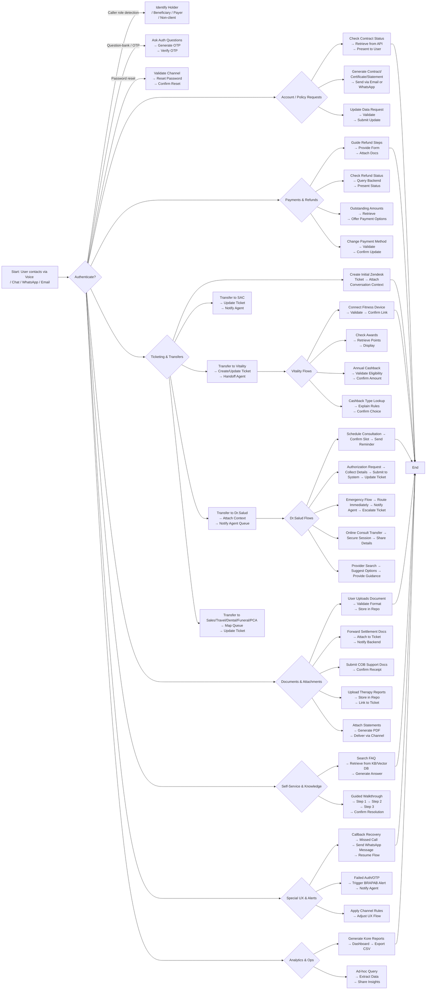

```mermaid
flowchart LR
%% Entry Points
A[Start: User contacts via Voice <br>/ Chat / WhatsApp / Email]

%% Authentication & Identity
A --> B{Authenticate?}
B -->|Caller role detection| B1[Identify Holder <br>/ Beneficiary / Payer <br> / Non-client]
B -->|Question-bank / OTP| B2[Ask Auth Questions <br>→ Generate OTP <br>→ Verify OTP]
B -->|Password reset| B3[Validate Channel <br>→ Reset Password <br>→ Confirm Reset]

%% Account / Contract / Policy
B --> C{Account / Policy Requests}
C --> C1[Check Contract Status <br>→ Retrieve from API <br>→ Present to User]
C --> C2[Generate Contract/<br>Certificate/Statement <br>→ Send via Email or <br>WhatsApp]
C --> C3[Update Data Request <br>→ Validate <br>→ Submit Update]

%% Payments & Refunds
B --> D{Payments & Refunds}
D --> D1[Guide Refund Steps <br>→ Provide Form <br>→ Attach Docs]
D --> D2[Check Refund Status <br>→ Query Backend <br>→ Present Status]
D --> D3[Outstanding Amounts <br>→ Retrieve <br>→ Offer Payment Options]
D --> D4[Change Payment Method <br>→ Validate <br>→ Confirm Update]

%% Tickets & Transfers
B --> E{Ticketing & Transfers}
E --> E1[Create Initial Zendesk <br>Ticket → Attach <br>Conversation Context]
E --> E2[Transfer to SAC <br>→ Update Ticket <br>→ Notify Agent]
E --> E3[Transfer to Vitality <br>→ Create/Update Ticket <br>→ Handoff Agent]
E --> E4[Transfer to Dr.Salud <br>→ Attach Context <br>→ Notify Agent Queue]
E --> E5[Transfer to Sales/Travel/Dental/Funeral/PCA <br>→ Map Queue <br>→ Update Ticket]

%% Clinical / Health & Dr.Salud
E4 --> F{Dr.Salud Flows}
F --> F1[Schedule Consultation → Confirm Slot → Send Reminder]
F --> F2[Authorization Request → Collect Details → Submit to System → Update Ticket]
F --> F3[Emergency Flow → Route Immediately → Notify Agent → Escalate Ticket]
F --> F4[Online Consult Transfer → Secure Session → Share Details]
F --> F5[Provider Search → Suggest Options → Provide Guidance]

%% Vitality & Rewards
E3 --> G{Vitality Flows}
G --> G1[Connect Fitness Device <br>→ Validate → Confirm Link]
G --> G2[Check Awards <br>→ Retrieve Points <br>→ Display]
G --> G3[Annual Cashback <br>→ Validate Eligibility <br>→ Confirm Amount]
G --> G4[Cashback Type Lookup <br>→ Explain Rules <br>→ Confirm Choice]

%% Documents & Attachments
B --> H{Documents & Attachments}
H --> H1[User Uploads Document <br>→ Validate Format <br>→ Store in Repo]
H --> H2[Forward Settlement Docs <br>→ Attach to Ticket <br>→ Notify Backend]
H --> H3[Submit COB Support Docs <br>→ Confirm Receipt]
H --> H4[Upload Therapy Reports <br>→ Store in Repo <br>→ Link to Ticket]
H --> H5[Attach Statements <br>→ Generate PDF <br>→ Deliver via Channel]

%% Self-service & Knowledge
B --> I{Self-Service & Knowledge}
I --> I1[Search FAQ <br>→ Retrieve from KB/Vector DB <br>→ Generate Answer]
I --> I2[Guided Walkthrough <br>→ Step 1 → Step 2 <br>→ Step 3 <br>→ Confirm Resolution]

%% Special UX Processes
B --> J{Special UX & Alerts}
J --> J1[Callback Recovery <br>→ Missed Call <br>→ Send WhatsApp Message <br>→ Resume Flow]
J --> J2[Failed Auth/OTP <br>→ Trigger BRAPAB Alert <br>→ Notify Agent]
J --> J3[Apply Channel Rules <br>→ Adjust UX Flow]

%% Analytics & Ops
B --> K{Analytics & Ops}
K --> K1[Generate Kore Reports <br>→ Dashboard → Export CSV]
K --> K2[Ad-hoc Query <br>→ Extract Data <br>→ Share Insights]

%% End
C1 --> Z[End]
D1 --> Z
E1 --> Z
F1 --> Z
G1 --> Z
H1 --> Z
I1 --> Z
J1 --> Z
K1 --> Z

```