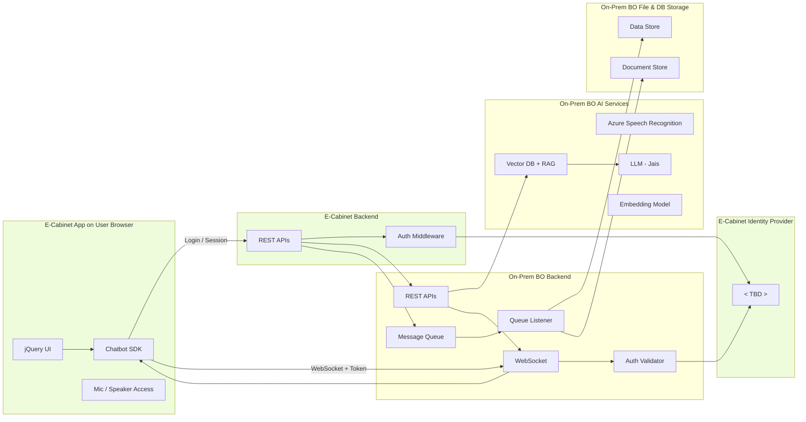
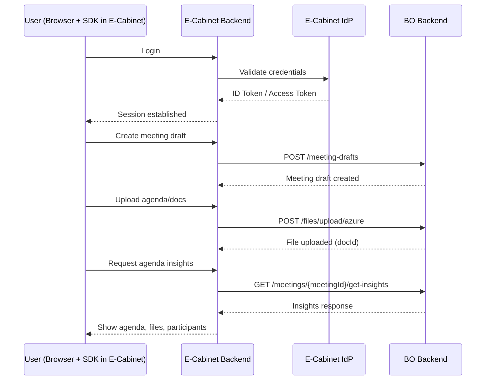
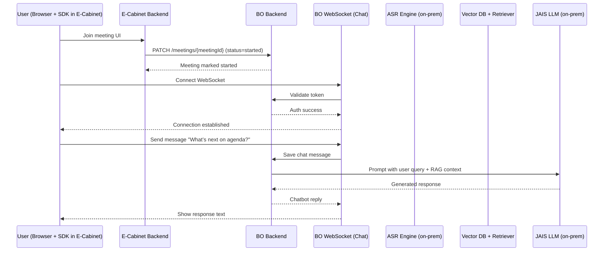
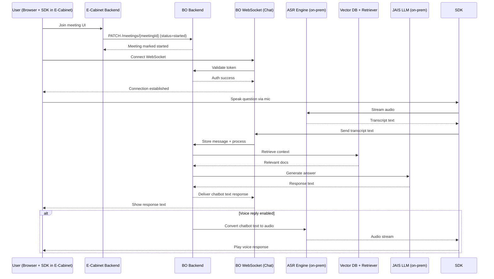
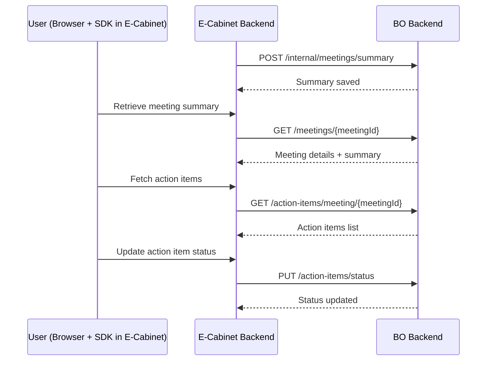

## Overview

E-Cabinet and BO are independent board meeting products. E-Cabinet lacks AI; it embeds BO's chatbot for enhanced Q&A on board-related documents/data. The requirement is to seamlessly embed a web-based chatbot SDK without impacting E-Cabinet's core functionality. The solution should ensure that E-Cabinet continues to be used for non-AI features, while leveraging BO's chatbot via data replication and embedding.

The solution will be deployed in DEV, QA, PROD on separate bare metal clusters. All components (LLM, Azure Speech Recognition/Synthesis equivalents, E-Cabinet/BO backends, web components) hosted on-premises on bare metal servers. No cloud dependencies; use containerized on-prem alternatives for speech services.

Both systems support multiple tenants, with isolation via tenant IDs in APIs, databases, and WebSocket rooms/namespaces.

This document describes the architecture of an **embedded chatbot SDK** that enables **text**, **voice-to-text**, and **voice-to-voice** conversational interactions inside **E-Cabinet** (the host app), which communicates with **BO** (the chat/meeting/AI platform). The solution supports full meeting lifecycles (pre-meeting, in-meeting, post-meeting) and is designed for **multi-tenant, on-prem bare-metal deployment** across DEV/QA/PROD environments.

---

## Objectives
  * Minimal changes to E-Cabinet’s UI, with a lightweight web SDK that handles all chat and voice features.
  * Secure, standards-based authentication -- TODO.
  * Use of RAG to ground the bot responses in uploaded meeting documents.
  * Real-time STT and TTS features.
  * Support all meeting lifecycle phases: **pre-meeting**, **in-meeting**, and **post-meeting**.
  * PMO tenant isolation (data, indices, access) and environment separation.
  * Observability, scalability, and fault tolerance.
  * Reuse existing BO backend services with minimal changes.

---

## Architecture
### Authentication
Users log in to E-Cabinet as usual. The embedded BO SDK sends a user token (Bearer) and userId to BO backend during initialisation. BO backend validates the token against E-Cabinet's IdP (Identity Provider). Once authenticated, users can use meeting features (including in-meeting chat).

### Meeting Features
E-Cabinet handles user operations (e.g., logins, create meeting, document upload) updates its own backend, and replicates necessary data to BO's backend. Documents uploaded to E-Cabinet are stored locally and pushed to BO (via API or queue) for indexing into a vector DB. This ensures BO has access to documents for RAG in the embedded chatbot.

### Chatbot Feature
An embeddable SDK for E-Cabinet's web app, that provides AI-powered chatbot features only (no full BO product integration). It supports:
  * **Text-to-text** messaging.
  * **Voice-to-text** (speech recognition for input).
  * **Voice-to-voice** (speech recognition for input and speech synthesis for output).

Chat interactions occur over secure WebSocket (socket.io). Sample exchange includes:
  * Handshake (e.g., sid, pingInterval).
  * Token submission.
  * Joining rooms (group/private modes via chatMode in metadata).
  * Starting chat sessions.
  * Ping/pong for keep-alive.
  * Messages include metadata like meetingType:"in-meeting".
BO backend provides RAG-based LLM responses using previously replicated documents.

### Overall Architecture

### Pre-Meeting Flow
User creates or updates a meeting, uploads files, generates agenda/insights.

### In-Meeting Flow
Meeting is started, users join chat, share docs, get live AI insights, and create action items.

#### Text Chat

#### Voice Chat

### Post-Meeting Flow
MoM, action items and follow-ups.

---

## Deployment architecture
<TBD>

---

## CI/CD Pipeline
<TBD>

---

## Hardware Sizing
<TBD>

---
## Networking, Security & Tenancy
<TBD>

---
## Backup, DR & Data retention
<TBD>

---
## Observability
<TBD>

---
## Glossary & Definitions
<TBD>

---